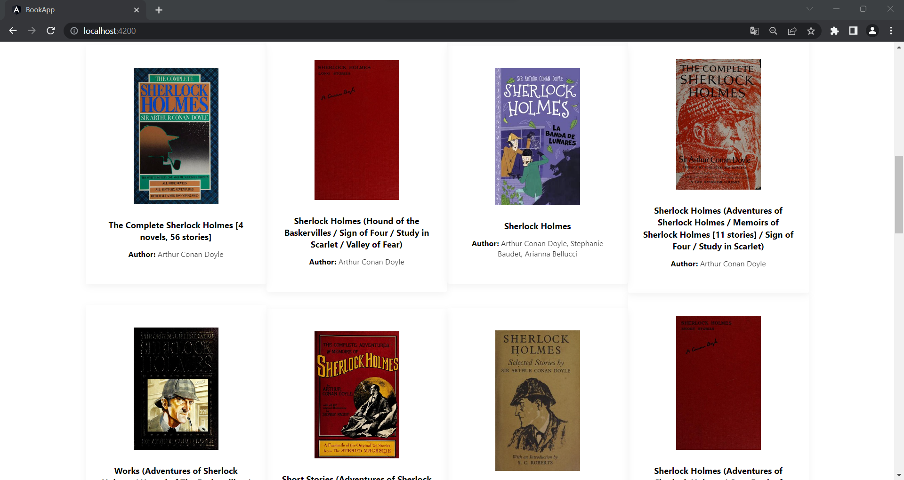
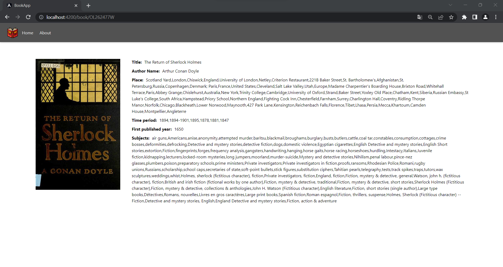
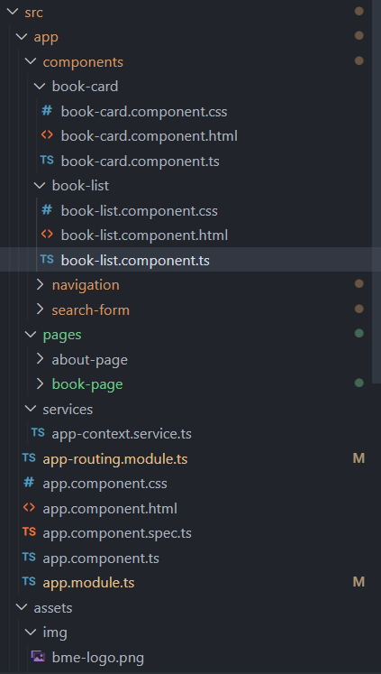
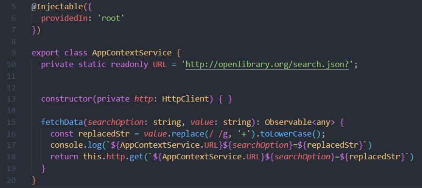

# Client-side technologies
## Technical documentation for Angular book-search app
## by Babii Alexandr 

### Introduction: 
The Book Search application allows users to search for books by entering title, author name or subject of the book. The result is presented in form of multiple responsive cards. 
 

By clicking on one of the cards the user gets redirected to a more in-depth description of the book. Powered by the Open Library API, this application provides a efficient way to explore a vast collection of books, with a focus on delivering relevant and accurate results.
 

### Main Functionality:
Upon launching the application, users are greeted with a clean and intuitive user interface that adapts to different screen sizes. The search bar prominently positioned at the top of the interface invites users to enter their desired keywords or select from different search criteria such as title, subject or author. 
Once the user submits their query, the application communicates with the Open Library API to fetch a list of relevant results. These results are presented in form of responsive cards that are highlighted when you hover over them.    
Clicking on a particular book from the search results opens up a detailed view, providing users with comprehensive information about the selected book. This includes not only basic details such as the title, author, and publication date but also additional enriching elements like a high-resolution cover image. Furthermore, the application supports responsive design, ensuring that the display of both search results and book details is optimized for all screen sizes, whether it's a desktop, tablet, or mobile device. 
For the styles I chose **Tailwindcss.**

### Structure

Structure of the project follows the Angular development conventions. The app folder contains the following subfolders: 
components: This folder holds the Angular components used in the application. Components are reusable building blocks with their own templates, styles, and logic. 
**pages:** This folder contains Angular components that represent individual pages or views of the application.  
**services:** The services folder contains  the only app-context.service.ts that creates Http connection to the OpenLibraryAPI. 

### Main Components:
**AppComponent:** This component serves as the main component of the application. It represents the root component that holds other components and provides the layout structure of the application. 
**BookListComponent:** This component is responsible for displaying a list of books. It may be used to show search results or a predefined list of books. 
**SearchFormComponent:** This component provides a search form where users can enter search criteria to fetch books. It may include input fields, buttons, and other elements related to search functionality. 
**BookCardComponent:** This component represents a single book card, which displays information about a book. It may include details like the book title, author, cover image, etc. 
**BookPageComponent:** This component represents a page that displays detailed information about a specific book. It may include additional details, such as a book description or reviews.

### Services

**AppContextService:** This service is provided at the root level (providedIn: 'root') and is responsible for fetching data from the Open Library API. It uses the Angular HttpClient to make HTTP requests to the API. The fetchData method in this service is used to retrieve data based on search criteria provided as parameters. The service replaces spaces in the search value with the '+' character and performs the HTTP GET request to the Open Library API. 

### Routing
The project utilizes Angular routing to navigate between different pages. The routing configuration is defined in the AppRoutingModule. The configured routes include: 
&emsp;'/' (root): Maps to the AppComponent, representing the home page of the application. 
&emsp;'/about': Maps to the AboutPageComponent, displaying information about the application. 
&emsp;'book/:id' : Dynamically maps to the BookPageComponent of the book that the user chooses from the BookList. Ex: /book/OL82586W 
This documentation gives an overview of the project structure and its components, services, routing, and HTML markup. It serves as a starting point for understanding the organization and functionality of the Angular project.

### OpenLibraryAPI
In the development I have been using Open Library Search API docs: Developer Center / APIs | Open Library . It provides several API, most useful for me where Search API and Books API. 
Search API has the following URL format: 
&emsp;https://openlibrary.org/search.json?title=the+lord+of+the+rings 
Using the same format you can get all of the necessary information: BookCoverUrl, Author Name, book’s subjects and many more.

### Development tools and Run 
The application has been developed using: 
Node.js v18.10.0 
Angular: 15.2.9  
Visual Studio Code: Version: 1.78.2 
To start the application, from the terminal run the commands:  
**npm install**    and then,    **npm start**

